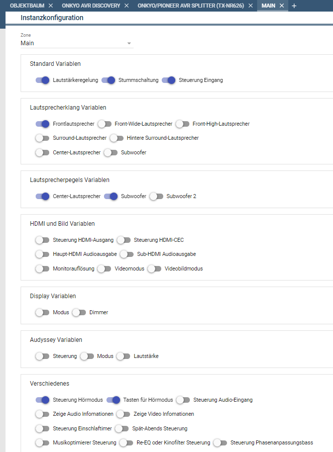
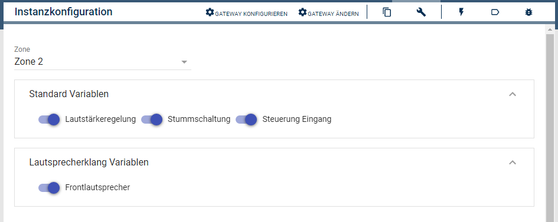
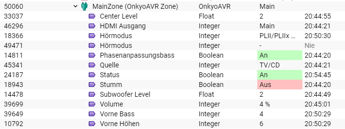
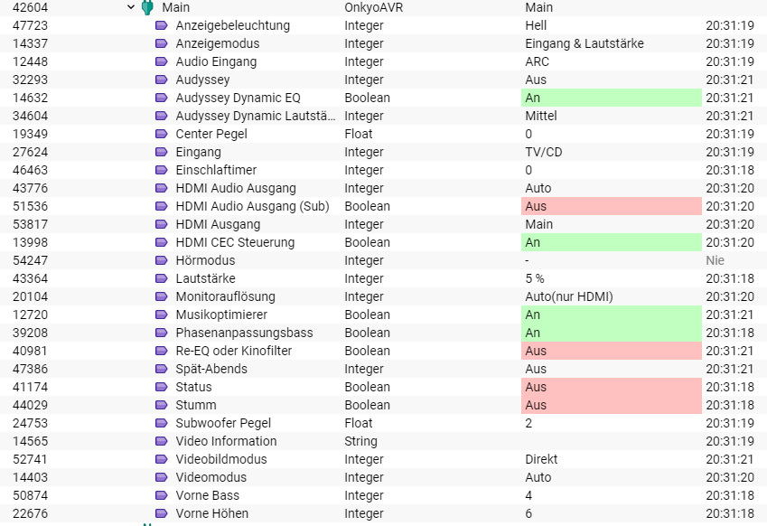
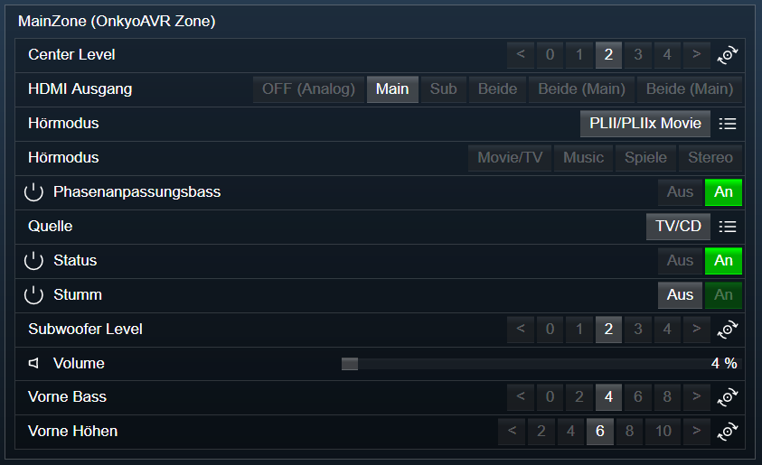

[](https://www.symcon.de/service/dokumentation/entwicklerbereich/sdk-tools/sdk-php/)
[]()
[](https://creativecommons.org/licenses/by-nc-sa/4.0/)  
[](https://www.symcon.de/forum/threads/30857-IP-Symcon-5-1-%28Stable%29-Changelog)
[](https://styleci.io/repos/45338104)  

# Onkyo & Pioneer AVR Zone (Onkyo AVR)
Bildet eine der Zones eines Gerätes in IP-Symcon ab.  

## Dokumentation

**Inhaltsverzeichnis**

1. [Funktionsumfang](#1-funktionsumfang) 
2. [Voraussetzungen](#2-voraussetzungen)
3. [Software-Installation](#3-software-installation)
4. [Einrichten der Instanzen in IP-Symcon](#4-einrichten-der-instanzen-in-ip-symcon)
5. [Statusvariablen und Profile](#5-statusvariablen-und-profile)
6. [WebFront](#6-webfront)
7. [PHP-Befehlsreferenz](#7-php-befehlsreferenz) 
8. [Lizenz](#8-lizenz)

## 1. Funktionsumfang

 - Darstellen von Zuständen der Zone.    
 - Bedienung aus dem WebFront.  
 - Bereitstellung von PHP-Befehlen zur Steuerung durch Scripte.  

## 2. Voraussetzungen

 - IPS ab Version 5.1  
 - kompatibler AV-Receiver mit LAN-Anschluß oder RS232 (RS232 Geräte haben einen eingeschränkten Leistungsumfang)  

## 3. Software-Installation

Dieses Modul ist ein Bestandteil des Symcon-Modul: [Onkyo & Pioneer AVR](../)  

## 4. Einrichten der Instanzen in IP-Symcon

Eine einfache Einrichtung ist über die im Objektbaum unter 'Discovery Instanzen' zu findene Instanz [Onkyo bzw Pioneer AVR Discovery'](../OnkyoAVRDiscovery/readme.md) möglich.  

Bei der manuellen Einrichtung ist das Modul im Dialog 'Instanz hinzufügen' unter den Hersteller 'Onkyo' zufinden.  
  

In dem sich öffnenden Konfigurationsformular ist die gewünschte Zone auszuwählen.  
Weitere Einstellungen ergeben sich auch der gewählten Zone.  
Viele Funktionen stehen nur in der 'MainZone' zur Verfügung.  
Zone 2, 3 und 4 haben, je nach Gerät, ein deutlich kleineres Spektrum an verfügbaren Einstellungen und Funktionen.  
  

**Konfiguration MainZone:**  
  
**Konfiguration Zone 2:**  
  

## 5. Statusvariablen und Profile

Jede Zone erstellt ihre Statusvariablen und einige Profile dynamisch, je nach Fähigkeiten der Geräte/Zonen und der Instanz-Konfiguration. 
Es können in der Konfiguration bestimmte Statusvariablen ab/angewählt werden.  
Diese werden jedoch nur erzeugt, wenn das Gerät auch eine (sinnvolle) Antwort liefert.  
**Beispiel Main Zone, Werkseinstellungen:**  
  
**Beispiel Main Zone bei TX-626 mit allen Funktionen in der Instanz aktiviert:**  
  

**Eine Auflistung aller möglichen Statusvariablen pro Zone folgt noch.** 

**Eine Auflistung aller Profile folgt noch.** 

## 6. WebFront

Die direkte Darstellung im WebFront ist möglich, es wird aber empfohlen mit Links zu arbeiten.  

**Beispiel Main Zone, Werkseinstellungen:**  
  


## 7. PHP-Befehlsreferenz

**Eine Beschreibung aller Funktionen folgt noch.**  

```php
bool OAVR_RequestState(int $InstanzeID, string $Ident);
```
```php
bool OAVR_Power(int $InstanzeID);
```
```php
bool OAVR_PowerOn(int $InstanzeID);
```
```php
bool OAVR_PowerOff(int $InstanzeID);
```
```php
bool OAVR_SetVolume(int $InstanzeID, int $Value);
```
```php
bool OAVR_SetMute(int $InstanzeID, bool $Value);
```
```php
bool OAVR_SelectInput(int $InstanzeID, int $Value);
```
```php
bool OAVR_SelectAudioInput(int $InstanzeID, int $Value);
```
```php
bool OAVR_SelectListingMode(int $InstanzeID, int $Value);
```
```php
bool OAVR_SetSleep(int $InstanzeID, int $Duration);
```
```php
bool OAVR_SetSubwooferLevel(int $InstanzeID, float $Level);
```
```php
bool OAVR_SetSubwoofer2Level(int $InstanzeID, float $Level);
```
```php
bool OAVR_SetDisplayMode(int $InstanzeID, int $Value);
```
```php
bool OAVR_SetDisplayDimmer(int $InstanzeID, int $Level);
```
```php
array OAVR_GetAudioInfomation(int $InstanzeID);
```
```php
array OAVR_GetVideoInfomation(int $InstanzeID);
```
## 8. Lizenz

  IPS-Modul:  
  [CC BY-NC-SA 4.0](https://creativecommons.org/licenses/by-nc-sa/4.0/)  
