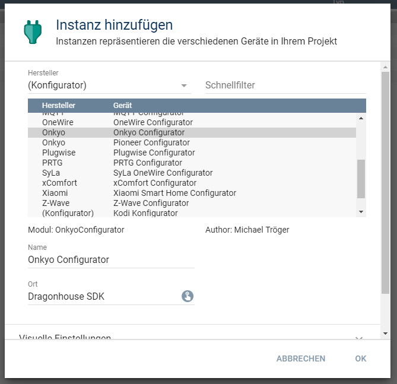

  

  

# Onkyo & Pioneer Configurator  
Vereinfacht das Anlegen von verschiedenen Instanzen für einen AV-Receiver.    

## Dokumentation

**Inhaltsverzeichnis**

1. [Funktionsumfang](#1-funktionsumfang) 
2. [Voraussetzungen](#2-voraussetzungen)
3. [Software-Installation](#3-software-installation)
4. [Einrichten der Instanzen in IP-Symcon](#4-einrichten-der-instanzen-in-ip-symcon)
5. [Statusvariablen und Profile](#5-statusvariablen-und-profile)
6. [WebFront](#6-webfront)
7. [PHP-Befehlsreferenz](#7-php-befehlsreferenz) 
8. [Lizenz](#8-lizenz)

## 1. Funktionsumfang

 - Auslesen und darstellen aller vom Gerät bekannten Zonen und Funktionen.  
 - Einfaches Anlegen von neuen Instanzen in IPS.  

## 2. Voraussetzungen

 - IPS ab Version 5.1  
 - kompatibler AV-Receiver mit LAN-Anschluß (RS232 Geräte werden nicht unterstützt.)  

## 3. Software-Installation

Dieses Modul ist ein Bestandteil des Symcon-Modul: [Onkyo & Pioneer AVR](../)  

## 4. Einrichten der Instanzen in IP-Symcon

Eine einfache Einrichtung ist über die im Objektbaum unter 'Discovery Instanzen' zu findene Instanz [Onkyo bzw Pioneer AVR Discovery'](../OnkyoAVRDiscovery/readme.md) möglich.  

Bei der manuellen Einrichtung ist das Modul im Dialog 'Instanz hinzufügen' unter den Hersteller 'Onkyo' zufinden.  
  

Alternativ ist es auch in der Liste alle Konfiguratoren aufgeführt.  
  

Es wird automatisch eine 'ISCP Splitter' Instanz erzeugt, wenn noch keine vorhanden ist.  
Werden in dem sich öffnenden Konfigurationsformular keine Geräte angezeigt, so ist zuerst die IO-Instanz korrekt zu konfigurieren.  
Diese kann über die Schaltfläche 'Gateway konfigurieren' und dann 'Schnittstelle konfigurieren' erreicht werden.  

Ist der Splitter korrekt verbunden, wird beim öffnen des Konfigurator folgendender Dialog angezeigt.  
  

Über das selektieren eines Eintrages in der Tabelle und betätigen des dazugehörigen 'Erstellen' Button,  
können Instanzen in IPS angelegt werden.  

## 5. Statusvariablen und Profile

Der Konfigurator besitzt keine Statusvariablen und Variablenprofile.  

## 6. WebFront

Der Konfigurator besitzt keine im WebFront darstellbaren Elemente.  

## 7. PHP-Befehlsreferenz

Der Konfigurator besitzt keine Instanz-Funktionen.  

## 8. Lizenz

  IPS-Modul:  
  [CC BY-NC-SA 4.0](https://creativecommons.org/licenses/by-nc-sa/4.0/)  
